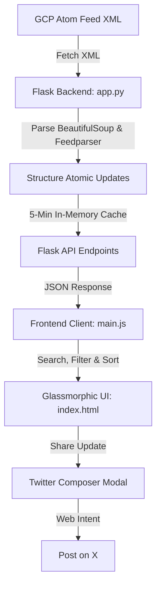

# BigQuery Release Notes Explorer

A high-fidelity, interactive web application that parses the official Google Cloud BigQuery release notes Atom feed and showcases them in a premium glassmorphic dashboard. Users can search, filter, and share specific updates directly to X (Twitter) using a realistic composer preview modal.

---

## 🛠️ Architecture

The application is split into a lightweight Python Flask backend and a clean, responsive single-page frontend:



### 1. Backend (`app.py`)
*   **Feed Parser**: Uses `feedparser` to parse the Atom feed and `BeautifulSoup` (`bs4`) to split compound date entries (which often list multiple features, issues, and announcements together) into **discrete, atomic updates**.
*   **Caching Layer**: Features a 5-minute memory cache to ensure fast responses and limit downstream network calls to GCP feeds.
*   **Endpoints**:
    *   `GET /`: Serves the primary web page template.
    *   `GET /api/release-notes`: Returns cached or freshly parsed release notes.
    *   `GET /api/release-notes/refresh`: Bypasses the cache to fetch live feed data.

### 2. Frontend (`index.html`, `styles.css`, `main.js`)
*   **Layout & Styling**: Styled entirely in vanilla CSS using dark mode, glassmorphism, responsive grid alignments, pulsing skeleton placeholders, and color-coded indicator tags.
*   **Interactivity**: Client-side searching, sorting, and category filters (Features, Announcements, Breaking, Issues, and Changes) are performed dynamically in JavaScript.
*   **Twitter Web Intent**: Uses a custom text-truncation algorithm to generate pre-filled tweets that fit within Twitter's 280-character limit, simulating X's rule of treating all links as exactly 23 characters.

---

## 💻 Setup Instructions for Windows

Follow these steps to run the application locally on Windows:

### Step 1: Open PowerShell or Command Prompt
Open your terminal of choice and navigate to the project directory:
```powershell
cd "C:\Users\MUHAMMAD FATHONI\Documents\agy-cli-projects\bq-release-notes"
```

### Step 2: Create a Virtual Environment (Recommended)
Isolate your python dependencies by creating a local virtual environment:
```powershell
python -m venv venv
```

### Step 3: Activate the Virtual Environment
Activate the environment in your shell:

*   **In PowerShell**:
    ```powershell
    .\venv\Scripts\Activate.ps1
    ```
    *(Note: If you receive a script execution error, run `Set-ExecutionPolicy -ExecutionPolicy RemoteSigned -Scope Process` first)*
    
*   **In Command Prompt (CMD)**:
    ```cmd
    .\venv\Scripts\activate.bat
    ```

### Step 4: Install Dependencies
Install Flask, feedparser, BeautifulSoup4, and Requests:
```powershell
pip install flask feedparser beautifulsoup4 requests
```

### Step 5: Start the Server
Run the Flask server:
```powershell
python app.py
```

You should see output indicating the server is serving on `http://127.0.0.1:5000`.

---

## 🚀 How to Use the App

1.  **View Updates**: Open your browser to **[http://127.0.0.1:5000](http://127.0.0.1:5000)** to browse the feed timeline.
2.  **Search & Filter**: 
    *   Type keywords into the search bar at the top to filter items instantly.
    *   Click on the category chips (e.g., **Features**, **Announcements**, **Breaking**) to drill down into specific update types.
    *   Sort the timeline chronologically using the sorting dropdown (Newest vs. Oldest).
3.  **Refresh Feed**: Click the **Refresh** button in the header. The icon will spin while the backend queries GCP and updates the UI using sleek skeleton card templates.
4.  **Tweet an Update**:
    *   Click the **Tweet** button on any card.
    *   An editor modal will pop up, simulating a dark-mode post composer on X.
    *   Edit the text to your liking. The character counter and circular progress ring will update dynamically. If you exceed 280 characters, the composer will warn you.
    *   Click **Post on X** to open a new tab containing the pre-filled post, ready to share with your audience.
